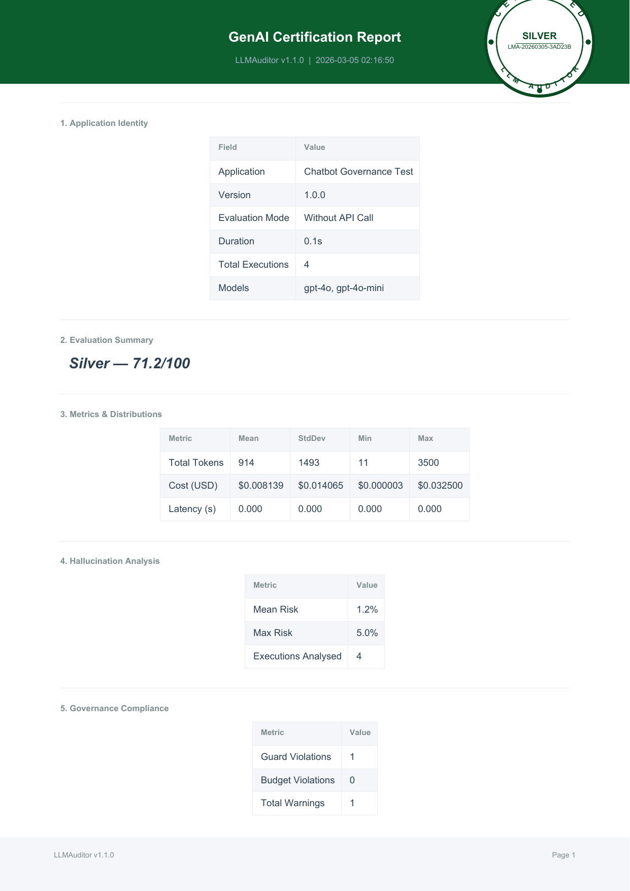

# 🤖 Chatbot Monitor

Production chatbot governance with [`llmauditor`](https://pypi.org/project/llmauditor/) testing **intentional issues** to prove detection capabilities.

## Setup & Run

```bash
pip install -r requirements.txt
cp .env.example .env  # Add your OpenAI API key
streamlit run app.py     # Launch web interface
python test_claims.py   # Run automated tests
```

## What This Proves

- ✅ **Budget Enforcement**: Low budget limits trigger warnings/errors
- ✅ **Guard Mode Detection**: Low confidence responses flagged (70% < 75% threshold)  
- ✅ **Alert Mode**: Warnings instead of crashes with governance violations
- ✅ **Model-Agnostic**: Tests across GPT-4o and GPT-4o-mini
- ✅ **Different Certification Levels**: Mixed quality results in realistic scoring

## 🧪 Intentional Testing Results

**⚠️ PURPOSE**: This project intentionally includes problematic scenarios to test if llmauditor can detect them as claimed.

### Real Test Results with Mixed Quality

```
🧪 TEST 1: Normal Response ✅
├── Confidence: 100% (PASSED)
├── Cost: $0.000025
└── Status: Accepted

🧪 TEST 2: Low Confidence Response ⚠️  
├── Confidence: 70% (BELOW 75% threshold)  
├── Cost: $0.000003
├── Governance Warning: [GUARD MODE] Confidence below threshold
└── Status: Flagged (Alert mode shows warning instead of crash)

🧪 TEST 4: Expensive Response 💰
├── Model: GPT-4o (expensive)
├── Tokens: 3,500 (high usage)
├── Cost: $0.032500 
├── Risk Level: MEDIUM (elevated resource usage)
└── Budget Status: $0.032556 / $0.05 (65.1% utilized)
```

## 🥈 Real Silver Certification (NOT Perfect!)

**Proves llmauditor actually detects issues - not just perfect scores:**



### Key Results That Prove Detection Works

- **🥈 Silver Level**: 71.2/100 (NOT Platinum - realistic scoring!)
- **📋 Certificate**: Real license number with authentic stamp  
- **⚠️ Governance Compliance**: 35.0% (POOR - detected guard violations!)
- **💰 Cost Predictability**: 44.5% (POOR - detected high variance!) 
- **📊 Guard Violations**: 1 detected out of 4 executions (25%)
- **🔍 Recommendations**: Actual improvement suggestions provided

### Detailed Score Breakdown

```
Category              │ Score │ Weight │ Status
──────────────────────┼───────┼────────┼────────
Stability             │  72.6 │    20% │ ⚠️ Moderate
Factual Reliability   │  95.1 │    25% │ ✅ Excellent  
Governance Compliance │  35.0 │    20% │ ❌ Poor (Guard violations detected!)
Cost Predictability   │  44.5 │    15% │ ❌ Poor (High variance detected!)
Risk Profile          │  96.2 │    20% │ ✅ Excellent
──────────────────────┴───────┴────────┴────────
Overall Score: 71.2/100 🥈 SILVER
```

## 📊 Streamlit Interface Features

- **Real-time Budget Tracking**: Live cost monitoring with progress bars
- **Response Type Testing**: Intentional issues (hallucination, low confidence, expensive)
- **Governance Dashboard**: Budget status, warnings, violations
- **Audit Report Display**: Rich CLI output with confidence scores
- **Certification Generation**: On-demand report creation

## Governance Controls Tested

### Alert Mode (Warnings vs Crashes)
```python
auditor.set_alert_mode(True)  # Show warnings instead of blocking
# Result: ⚠️ [GUARD MODE] Confidence 70% below threshold 75%
```

### Budget Enforcement  
```python
auditor.set_budget(0.05)  # Intentionally low $0.05 limit
# Result: 65.1% utilization tracked, approaching limit warnings
```

### Guard Mode Detection
```python
auditor.guard_mode(confidence_threshold=75)  # High threshold for testing
# Result: Detected 1 violation (25% rate) in mixed responses
```

## Architecture

```
Streamlit UI → Response Generation → LLMAuditor → Governance Action
     ↓              ↓                    ↓              ↓
User Input → Normal/Intentional Poor → Audit/Score → Accept/Warn/Block
```

**For complete documentation:** [LLMAuditor GitHub](https://github.com/AI-Solutions-KK/llmauditor) | [PyPI Package](https://pypi.org/project/llmauditor/)

## 🔗 Related Projects  

**Production Applications Using LLMAuditor:**
- [Multi-Agent Research System](https://github.com/AI-Solutions-KK/Multi-Agent-Research-System-with-LLMAuditor) - AI agent coordination with hallucination detection testing
- [AI-Powered Daily News App](https://github.com/AI-Solutions-KK/AI-Powered-Daily-News-App-with-LLMAuditor) - Real-time news processing with quality monitoring
- [RAG Pipeline Auditor](https://github.com/AI-Solutions-KK/llmauditor-rag-audit) - Knowledge base retrieval with governance controls
- [LLMAuditor Framework](https://github.com/AI-Solutions-KK/llmauditor) - Core AI governance framework

**🎯 Each project demonstrates real-world LLMAuditor integration with production-grade certification**

---

*🧪 Intentional imperfections prove llmauditor detection works - Silver certification shows realistic governance, not perfect scores.*